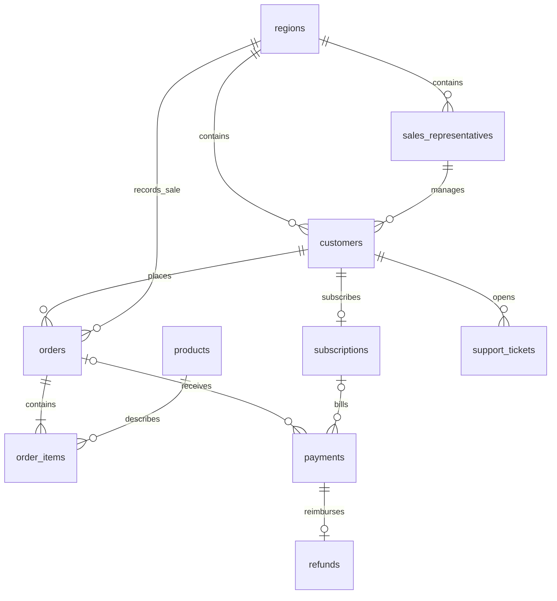

# Data foundation walkthrough

## Relationships and row meaning

A payment belongs to exactly one order or subscription. One completed payment per order is allowed; a failed attempt is not revenue. Each subscription generates monthly invoices on the start-date anniversary, clamped to the month's last day. This milestone has no retry workflow or proration. A cancelled subscription has no invoices on or after its first inactive date. Failed invoices do not immediately cancel the contract, so collected subscription cash and MRR can differ.

Orders capture a region and item prices at purchase time. Customer regions, segments, and representatives are static in this dataset. In a future model with account moves, subscription billing would also need historical dimension snapshots. Current product prices do not overwrite historical discounts. The order header total is intentionally stored for realistic transactional queries, even though it can be recomputed from items.

Refunds reference their payment; the order is reached through that payment. This avoids storing conflicting payment/order associations. Only order payments are refundable in this dataset, with at most one partial or full refund per payment. Multi-refund workflows and subscription refunds would require changes to the constraints and checks.

Support tickets supply contextual evidence and are linked to the customer. They are not causally linked to a particular refund or cancellation by a foreign key. Technical tickets accompany the synthetic product defect; cancellation tickets accompany subscription exits. The model does not claim that all nearby tickets caused a business event.

`customers.status` is the current subscription relationship at observation end, not an input to historical metrics. A customer who cancels their subscription can still buy a one-off service. A customer without a subscription remains active. Historical churn comes from subscription dates, with one lifecycle per customer. Reactivation, multiple simultaneous subscriptions, plan changes, and historical segment changes are deliberate exclusions.

`dataset_metadata` is one administrative row containing the observation window, seed, currency, and input content hash. It supplies a complete month calendar even when a month has no transactions. `schema_migrations` records the applied schema checksum.

## Major files, in reading order

| File | What it does and why it exists |
| --- | --- |
| `docker-compose.yml` | Starts PostgreSQL 17 with a persistent volume, loopback port, and readiness check. Its optional `seed` service waits for the database, then runs the Python loader. Keeping the loader separate makes reseeding explicit. |
| `.env.example` | Documents local database credentials and the host port. Compose substitutes these values. The copied `.env` is ignored by Git. |
| `Dockerfile` | Packages Python 3.12, Psycopg, SQL, scripts, metadata, and tests in a reproducible loader image. An optional CA build secret supports networks with private certificate authorities. |
| `backend/requirements.txt` | Pins the Psycopg PostgreSQL driver and its binary distribution, avoiding a local C compiler requirement. |
| `database/schema.sql` | Defines ten business tables plus dataset metadata, foreign keys, exact-decimal money, status checks, payment ownership, and indexes. Read a parent table before its children. |
| `database/metrics.sql` | Defines the month calendar and five aggregate views. Each view has one row per observed month. Historical metrics use date intervals. Refunds and payments aggregate separately to avoid duplicate sums. |
| `database/checks.sql` | Counts violations that need multiple rows or tables: item/header totals, completed order payment existence, invoice amounts and dates, refund eligibility, and event timelines. The loader refuses to commit violations. |
| `scripts/generate_data.py` | Builds records in dependency order using `random.Random(seed)` and `Decimal`, embeds events as probability changes, and optionally exports CSVs and a manifest. The fixed window and seed make results repeatable. |
| `scripts/seed_database.py` | Validates exported files or generates data in memory, applies version 1 once, loads tables with PostgreSQL `COPY`, and commits only after all checks pass. Bound SQL values and fixed identifiers keep user input out of SQL structure. |
| `backend/app/metadata/metrics.json` | Stores official definitions, formulas, source tables, permitted dimensions and filters, output units, and view names. JSON provides a structured contract without another parser dependency. Dimensions describe supported manual breakdowns; the aggregate views themselves expose monthly totals. |
| `scripts/verify_database.py` | Runs read-only integrity checks, prints the five metrics for the latest three observed months, and optionally enforces event thresholds for the default dataset. |
| `database/event_evidence.sql` | Recomputes three baseline/event comparisons from the loaded data. This is evidence and a spoiler for the exercises, not an automated root-cause engine. |
| `backend/tests/test_generator.py` | Verifies reproducibility, referential/economic consistency, manifest export, metadata fields, and detectable default events without PostgreSQL. |
| `backend/tests/test_database.py` | Tests actual PostgreSQL views and constraints using small fixtures with hand-calculated answers, then rolls the fixtures back. Also checks repeat seeding, failed-replacement rollback, and CSV tampering. |
| `README.md` | Gives exact setup, query, seed, test, and troubleshooting commands. |
| `docs/data-foundation.md` | Explains the schema, metric choices, file responsibilities, and intentional simplifications. |
| `docs/exercises.md` | Contains three investigations with expected output shapes and hints, leaving the SQL for you to write. |
| `.gitignore`, `.dockerignore` | Keep secrets, generated data, virtual environments, and caches out of source control and container build context. |
| `scripts/__init__.py`, `data/seed/.gitkeep` | Allow module imports in tests and retain an empty generated-data directory in Git. |

## Generator mechanics

1. Build four regions, two representatives per region, and six products.
2. Assign customers segments in an approximate 30% startup / 50% SME / 20% enterprise mix. About 65% sign up during the first three months; the remainder arrive throughout the window.
3. Give approximately 75% a monthly subscription. Segment determines a GBP 49, 199, or 999 plan. Baseline monthly cancellation probability is 1.2%; September enterprise probability is 38%.
4. Generate potential monthly one-off orders with segment-specific frequency. From July, North's purchase probability is multiplied by 0.18. Products, quantities, occasional 10% discounts, and one to three items create varied order values.
5. Record completed or failed payments. Some recent orders remain pending. Baseline refund probability is 2.5%; from August it rises to 42% for orders containing Analytics Export. Refunds arrive 2–10 days later, sometimes crossing month boundaries. Events beyond the observation end are not recorded.
6. Create contextual support tickets and export stable CSVs. The manifest hashes every file and records row counts and injection rules.

Probabilities create plausible variation rather than exact percentages in every slice. The default seed has explicit acceptance checks; other seeds and small samples may differ. No real customer names, email addresses, or proprietary records are used. The generator keeps rows in memory for readability at this scale; very large datasets would need streaming batches.

## Metric trade-offs and integrity boundaries

- Revenue is **gross collected cash**, not accrual-accounting revenue. Refunds are separate; a net-cash query subtracts independently aggregated refunds using their own dates.
- MRR is a **snapshot**, so summing MRR across months is not collected revenue. Contract values are fixed during each lifecycle.
- AOV excludes subscription invoices and ignores later refunds. Averaging monthly AOVs weights months equally; sum the order values and counts for a multi-month AOV instead.
- Refund rate uses this month's refund cash and this month's completed payment cash, including subscriptions. It is not the share of this month's purchases ultimately refunded, and can exceed 100% if old purchases are refunded in a low-sales month.
- Churn uses customers subscribed immediately before the month starts. A cancellation dated the first day counts; a customer who joins and leaves during the month is excluded from both numerator and denominator. This convention is explicit so boundary results can be checked.
- PostgreSQL enforces local checks, unique keys, and foreign keys on every write. Cross-table economic rules are enforced by `checks.sql` during seeding and verification, not by triggers. Manual edits can violate those economic rules, which the verifier will detect. This keeps the learning schema understandable; a future write API needs equivalent transactional validation or database triggers.
- Identical seed input is recognized using a content hash. A repeat run checks current row counts and integrity, but is not a full audit of every stored field against the CSVs. Use `--replace` to restore deliberately edited demo data exactly.
- Product breakdowns need a declared allocation method: an order-level payment joined to three item rows repeats three times. For completed order product sales, sum `quantity * unit_price` at item grain. Full order refunds cannot be attributed to a particular item without another business rule.

SQL security here is limited to trusted repository SQL and parameterized loading. No untrusted generated query runs. Later natural-language querying requires its own validation layer and database role; metadata alone is not a security boundary.
